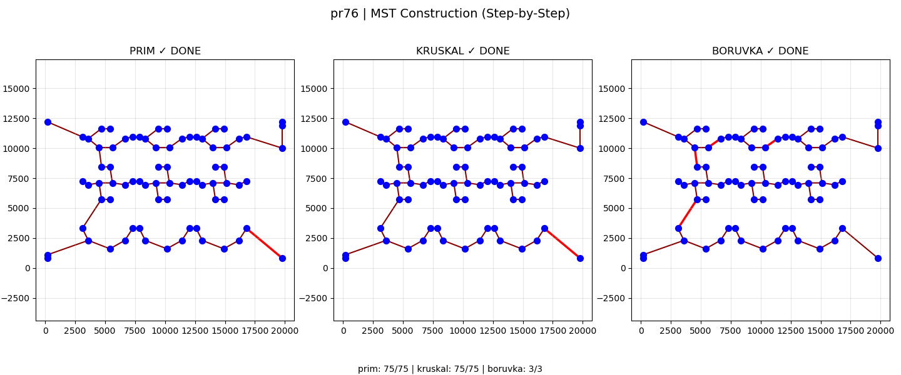

# Minimum Spanning Tree – Prim vs Kruskal vs Borůvka

<p align="center">
  
</p>


This project implements and compares three classical **Minimum Spanning Tree (MST)** algorithms:

- **Prim's Algorithm** (Lazy Heap / Priority Queue)
- **Kruskal's Algorithm** (Union-Find with Path Compression & Union by Rank)
- **Borůvka's Algorithm** (Parallel Component Merging)

The comparison is performed on real **TSPLIB EUC_2D instances** (official repository: https://github.com/pdrozdowski/TSPLib.Net/tree/master), focusing on:

- Algorithmic behavior
- Internal computational workload
- Execution time
- Structural differences
- Interactive visualization

The project provides both:
- 🔍 Interactive MST visualization
- 📊 Analytical benchmark comparison

---

## Requirements

Tested with **Python 3.10+**.

Install dependencies (Conda recommended):

```bash
conda create -n mst python=3.10
conda activate mst
conda install numpy matplotlib pandas networkx tqdm
conda install -c conda-forge mplcursors
```
---

Dataset

The project uses TSPLIB instances (EUC_2D, complete graphs):
```bash
dataset/
 ├─ berlin52.tsp
 ├─ st70.tsp
 └─ pr76.tsp
```

---
## Run Algorithm

Run any algorithm interactively:

```bash
python -m prim --tsp dataset/st70.tsp --plot
python -m kruskal --tsp dataset/st70.tsp --plot
python -m boruvka --tsp dataset/st70.tsp --plot
```

---
## Run Benchmark

Run per dataset:
```bash
python benchmark.py --tsp dataset/st70.tsp
```
---
## Output

Each algorithm reports:

- Execution time (ms)
- MST total weight
- Number of MST edges (should be n − 1)
- Algorithm-specific internal metrics


---

### Benchmark Output

The benchmark produces:

1. **Interactive step-by-step visualization**
2. **Validation summary table**
   - Optimized check (equal MST weights)
   - Cycle presence check
3. **Shared comparison plots**
   - Iterations / Phases
   - Total execution time
   - Work per accepted edge
   - Time per single MST edge
4. **Algorithm-specific performance plots**
   
### Prim
- Heap pushes
- Heap pops
- Stale pops (lazy heap overhead)
- Work per accepted edge

### Kruskal
- Edges scanned
- Rejected edges (cycle filtering)
- Union-Find calls
- Work per accepted edge

### Borůvka
- Number of phases
- Edges added per phase
- Estimated total edge scans (m × phases)
- Union-Find calls
- Work per accepted edge
---


## Notes

- Graphs are treated as **complete weighted graphs** derived from TSPLIB EUC_2D coordinates.
- Edge weights are computed using rounded Euclidean distance.
- Visualization uses `matplotlib` + `mplcursors` for interactive hover behavior.
- All three algorithms produce identical MST weights, confirming correctness.

